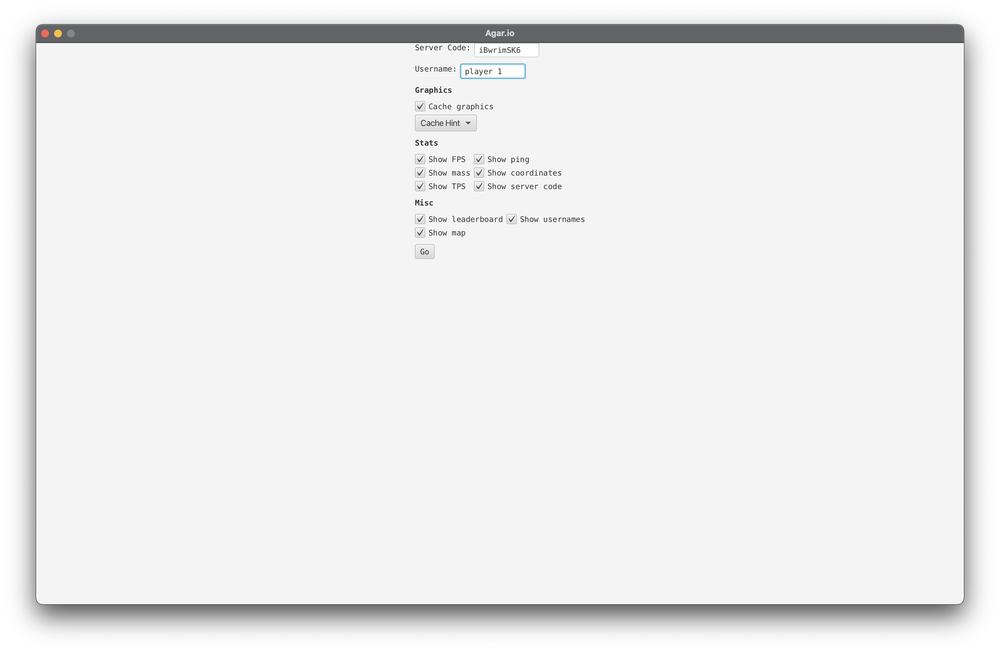
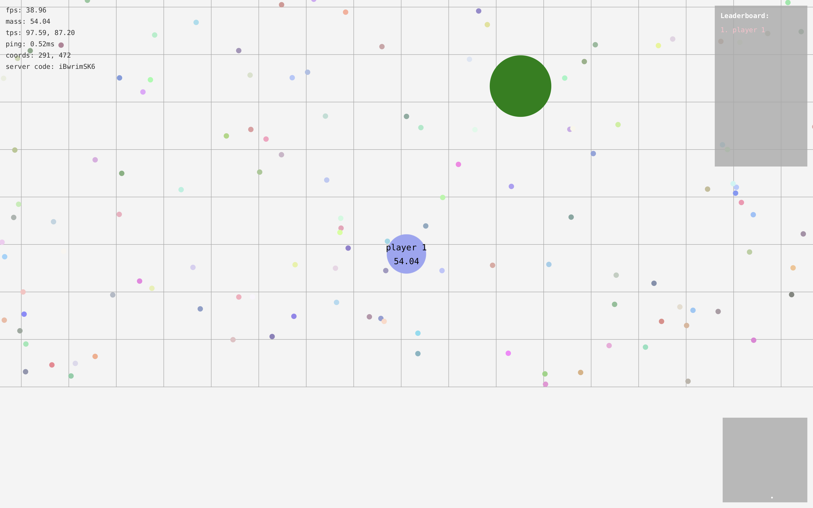

# AgarioClient

A Java client-implementation clone of the popular 2010's online game [Agar.io](agar.io).

See [AgarioServer](https://github.com/TheMoonThatRises/AgarioServer) for the server companion of this client.

## Prerequisites

- Minimum UDP packet size of `65_534` bytes
- Fast and reliable download speeds
- Recent CPU model (older models may face impacted FPS performance)

## Building

Much of the codebase uses bleeding-edge functions and syntax.

Tested Environment:

- ZuluFX 23
- IntelliJ IDEA
- MacOS 15.1
- Ubuntu 22.04
- 1 GB upload/download

`main` is located in the class `Client` and can be run using IntelliJ's "run" arrow.

## Multiplayer

Input the provided server code in the provided space and select your desired settings.

## Roadmap

- [] Updated virus texture
- [] Improve player death handling
- [] Cleaner landing page

See the server companion [AgarioServer](https://github.com/TheMoonThatRises/AgarioServer?tab=readme-ov-file#roadmap) for the extended roadmap.
